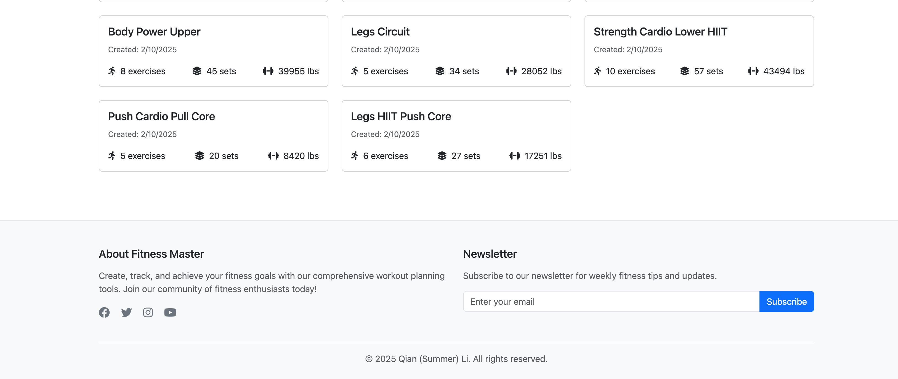

# CS5610_Project2

## Author

Qian (Summer) Li
[Github](https://github.com/summereth)

## Class Link

CS5610 Web Development [Course Page](https://johnguerra.co/classes/webDevelopment_spring_2025/)

Instructor: John Alexis Guerra Gómez [Profile](https://johnguerra.co/)

Provided by Northeastern University, Khoury College of Computer Sciences

## Project Objective

In this project we will apply concepts learned by building a basic backend application with Node + Express + Mongo and HTML5.

## Screenshots

### Homepage

### Create page

#### Initial State

#### Add new exercise - step 1 select a muscle group

#### Add new exercise - step 2 select an exercise

#### Add new exercise - step 3 set exercise details

## Instructions to build

### Option 1: Live demo

[Website link](https://fitnessmaster.vercel.app/)

Backend deployed with Vercel. Database deployed with MongoDB Atlas.

### Option 2: Run locally

#### Step 1: Git clone this repository

`git clone <-url->`

#### Step 2: Install dependency

cd into your local repository, and run
`npm install`

#### Step 3: Create your `.env` file

Copy `.example.env` file and change the name to `.env`. Modify environment variables according to your own preference.

#### Step 4: Seed exercise data

Run `npm run exercisedata:import` to seed exercise data into your local MongoDB server.

#### Step 5: Seed plan data

First, modify the variable `exerciseIds` in file `db/seederPlans.js` using the real exerciseIds in your local MongoDB database. (Sorry, I could have supported querying your exercises data here.)

Then run `npm run plandata:import <-row_number_you_wish_to_seed->`. For example, `npm run plandata:import 1000` will create 1000 randomly generated workout plan data in your database.

## Other documents

- [Google Slides](https://docs.google.com/presentation/d/1yN8TeCEl2tfzsiCDjfl2GAH-x4VFpQGGOiyhTQ7MJr0/edit?usp=sharing)
- [Video Walkthrough]()
- [Design_Document](./design_doc.md)

## GenAI usage

Claude 3.5 Sonnet assisted me in finishing this project.

### Use cases

#### Random data generation

Prompt:
Generate a JS file containing data of exercises. The exercises is an array of exercise object. Each exercise object contains name, muscle group and description (some exercise tips).

#### Client request with query

Prompt:
How can client side send request with some query. Please give me an example.

#### MongoDB query

Prompt:

- I'm using MongoDB with Node.js driver. Without using mongoose, how can I query document by ObjectId.
- How can I sort the query result.

#### Asynchronous programming issue with Array.map() function

Prompt:

Why my `convertedExercises` is an array of Promise. How should I modify the code so that I could get an array of exercise object

#### Lazy loading workout plans

Prompt:
Right now my frontend fetches workoutPlans from backend, and uses the data to insert html of both `card-header-section` and `card-details`. However, I wish to lazy load plan details. That is to say to display information in `card-details`​, front-end must request `GET /api/plans/:id`​. That means, in `createWorkoutCard()` function we can't insert Expandable Details part. And in `toggleCardDetails()` function, we need to send `GET /api/plans/:id​ `request and then inject `card-details`​ html. What are the key changes I need to make here.

#### POST HTTP Request

Prompt:
How to send POST request to backend with a body using just vanilla JavaScript

#### Vercel Deploy Issue

Prompt:

- Analyze this error:
  file:///Users/liqian/.nvm/versions/node/v20.12.2/lib/node_modules/vercel/node_modules/@vercel/node/dist/dev-server.mjs:1952
  return listener(req, res);
  ^
  TypeError: listener is not a function
  at Server.<anonymous> (file:///Users/liqian/.nvm/versions/node/v20.12.2/lib/node_modules/vercel/node_modules/@vercel/node/dist/dev-server.mjs:1952:12)
  at process.processTicksAndRejections (node:internal/process/task_queues:95:5)
  Node.js v20.12.2

- The deploy in dev is good. So I deployed it in production by running `vercel`. However, when I open the production url, there is an error in console:
  fitnessmaster-p7tr3bgl6-summers-projects-06a1372b.vercel.app/:1
  Failed to load resource: the server responded with a status of 404 ()

#### Dynamically fetch baseURL from front-end

Prompt:
Currently my frontend is requesting backend via `fetch("http://localhost:3000/api/plans")`. The url is hardcoded. However, my application may run in another port. How should I modify the code
