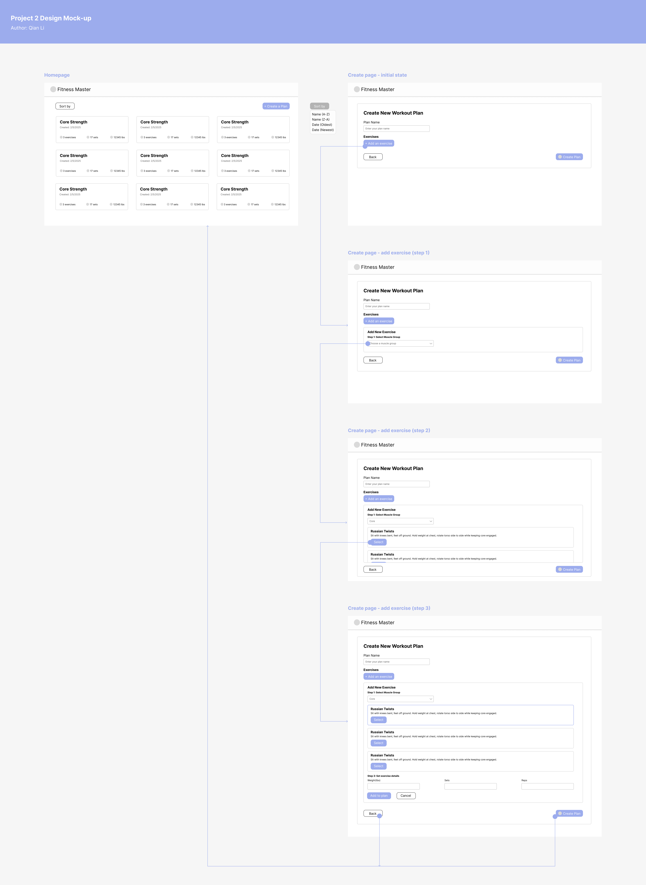

# Design Document

## Project Description

The Fitness Record Application simplifies workout planning by providing users with a comprehensive exercise library and workout planning capabilities. The application focuses on two core features: a pre-populated exercise library for reference and a workout plan creator for organizing training sessions.

### Core Features

#### 1. Exercise Library

- Pre-populated database of exercises
- Each exercise includes:
  - Name
  - Detailed description, including tips
  - Target muscle groups
- Users can browse and view exercise details
- Search and filter functionality
  - User select a muscle group and view filtered exercises

#### 2. Workout Plan Creator

- Create personalized workout plans
- Set plan name
- Select exercises from the library
- Specify sets, reps, and weights for each exercise
- Save and view created workout plans

## User Personas

### Emily - The Gym Newcomer

- **Demographics:** 28 years old, marketing professional
- **Goals:**
  - Learn about different exercises
  - Create structured workout routines
- **Pain Points:**
  - Overwhelmed by exercise variety
  - Unsure how to structure workouts
  - Needs guidance on exercise selection
- **Usage Patterns:**
  - Frequently references exercise descriptions
  - Creates basic workout plans
  - Prefers simple, straightforward interfaces

### Mike - The Regular Gym-Goer

- **Demographics:** 35 years old, software developer
- **Goals:**
  - Organize workout routines efficiently
  - Access detailed exercise information
  - Create varied workout plans
- **Pain Points:**
  - Wants to organize workouts systematically
  - Needs quick access to exercise details
  - Requires flexibility in workout planning
- **Usage Patterns:**
  - Creates multiple workout plans
  - References exercise details for form reminders
  - Regularly updates workout parameters

## User Stories

### Exercise Library

1. As a user, I want to browse all available exercises so that I can learn about different workout options

   - View list of all exercises grouped by muscle groups
   - Access detailed description and tips for each exercise

2. As a user, I want to filter exercises by category so that I can find specific types of exercises

   - Filter by exercise category (muscle group)
   - View filtered results
   - Reset filters as needed

### Workout Plan Creator

1. As a user, I want to create a new workout plan so that I can organize my training

   - Enter plan name
   - Save basic plan details

2. As a user, I want to add exercises to my workout plan so that I can structure my training

   - Browse exercise library
   - Select exercises for the plan
   - Specify order of exercises

3. As a user, I want to set specific parameters for each exercise so that I can define my workout intensity

   - Set number of sets
   - Specify reps per set
   - Input target weights

4. As a user, I want to view my saved workout plans so that I can access them during training
   - Access list of saved plans
   - View plan details
   - See all exercises and parameters

## Design Mockup

[Figma](https://www.figma.com/design/hZOJtxIxFm480Q9flBV4eZ/CS5610_Project_Design?node-id=8-3&t=jf6I4Lh2K87DHxbU-1)

